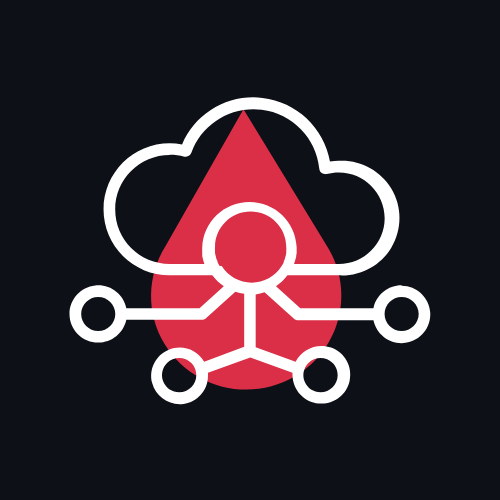

<!-- Project Logo -->

  

<h1 align="center">From Zero to Financial Hero</h1>
<!-- Our logo needs to go here to the right of the following sentence -->
<h2 align="center">
  Presented by <strong>CodeBlooded</strong> 
  
</h2>

  
  &nbsp;
  
  &nbsp;
  
  &nbsp;
  
  &nbsp;
  
  &nbsp;
  
  &nbsp;
  
  &nbsp;
  

  

<h2 align="center">Project Overview </h2> 
Gamified Financial Visualizer revolutionizes the way people interact with their finances. By combining gamification, AI-powered insights, and AR/VR visualization, users are empowered to take control of their spending, saving, and goal-setting while enjoying the journey.

> "Financial literacy doesn't have to feel like homework anymore" - Our Vision

  

## 🚀 Core Features That Deliver Results

| Feature | Benefit | Tech Behind It |
|---------|---------|----------------|
| **AI Financial Coach** | Personalized money advice 24/7 | NLP, Machine Learning |
| **AR Spending Tracker** | See expenses as interactive 3D objects | ARKit, Three.js |
| **Goal Gamification** | Earn rewards for financial milestones | Smart Algorithms |
| **Bank-Grade Security** | Read-only access protects user data | OAuth 2.0, Encryption |

  

<h2 align="center">Tech Stack That Powers Innovation</h2>
<h3 align="center">Frontend: Next-Level User Experiences </h3>

  

<h3 align="center">Backend: Rock-Solid Foundation </h3>

   
  

<h3 align="center">DevOps: Enterprise-Grade Delivery </h3>

  

<h3 align="center">Testing: For smooth system delivery </h3>

  

<h3 align="center">Project Management: With modern technology</h3>

  

  

<h2 align="center">Project Documentation Index </h2>

This table provides quick access to the key documents and planning resources for the Gamified Financial Visualizer project.

| Resource Name | Description | Link |
|---------------|-------------|------|
| **Software Requirements Specification (SRS)** | Outlines the functional and non-functional requirements of the system. | [View SRS](https://drive.google.com/file/d/1P-zHO8nlxd5WIi0egwTgvPa18IMBnqpN/view?usp=drive_link) |
| **Architectural Requirements Specification (ARS)** | Describes system architecture, service design, and technology stack. | [View ARS](https://drive.google.com/file/d/12cjEbAv0dVkkijhgKKI28h0UNA2BDMBG/view?usp=drive_link) |
| **User Stories** | User-focused feature breakdown using Agile methodology. | [View User Stories](https://drive.google.com/file/d/15W0QNBl9YfHC1M-liT4e9_xkXi2rQUrP/view?usp=drive_link) |
| **Use Cases** | Details of system interactions between users and core features. | [View Use Cases](https://drive.google.com/file/d/1RYJx_-DA8SJ5KiFeP35hvWPykjhdn8F3/view?usp=drive_link) |
| **Project Board & Sprint Tracker** | A live board displaying tasks, issues, and sprint progress. | [GitHub Project Board](https://github.com/orgs/COS301-SE-2025/projects/140) |
| **Domain Model** | A visual representation of key entities and their relationships. | [View Domain Model](https://drive.google.com/file/d/172k-GoCfRzXFlRVkc58cxvUSWxHhIxoS/view?usp=drive_link) |
| **Project / Group Framework** | Overview of team structure, responsibilities, and collaboration tools. | [View Group Framework](https://www.notion.so/Gamified-Financial-Visualizer-1f842477e71680879e19d535dcb688dc?pvs=4) |

  

<h2 align="center">Demo Video </h2>

| Demo Video | Documentation |
|------------|----------------|
|[ Demo 1 Video](https://drive.google.com/drive/u/0/folders/11WsEpVxedP9OobPVyirSWup9hacDLVAH) | [Demo 1 Documentation](https://drive.google.com/drive/u/0/folders/1oXzqPzukLE2dVK9OftUkWXMTAlR7tb4I) |
|[ Demo 2 Video](/////////////////////////) | [Demo 2 Documentation](https://drive.google.com/file/d/1AtsfSCTiknyl33-kCOrxDX3IxPY_VsbB/view?usp=drive_link) |

  

<h2 align="center">Meet the CodeBlooded Team</h2>

  

| Photo | Name | About | Role | Links |
|-------|------|-------|------|-------|
|  | **Yohali Malaika Kumangu** | Experienced in Java development with a portfolio of diverse, hands-on projects leveraging the language. Proficient in backend technologies, particularly Node.js, with a strong background in financial management. Skilled in integration development with Python, MongoDB, and Node.js. | Project Manager, Data Engineer |     |
|  | **Lebogang Masenya** | Possesses foundational experience in Data Science, having implemented small-scale machine learning models. Familiar with AI tools such as Hugging Face, applied in full-stack personal projects. | Systems Architect, Services Engineer |     |
|  | **Mpho Siminya** | A creative front-end developer with a strong ability to translate Figma wireframes into responsive web apps. Proficient in React and has explored 3D modeling in Blender for AR interfaces. | UI Engineer, UI/UX Designer |     |
|  | **Nobuhle Mtshali** | Proficient in React and Java, with a strong foundation in UI/UX and responsive development. Passionate about immersive VR/AR solutions and driving financial literacy through engaging experiences. | DevOps, UI Engineer |     |
|  | **Aundrea Ncube** | Skilled in JavaScript, PHP, and Java. Strong in DBMS and API integration. Proficient in both frontend and backend development for seamless system integration. | Integration & Testing Engineer |     |

  

