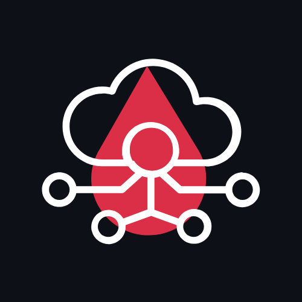
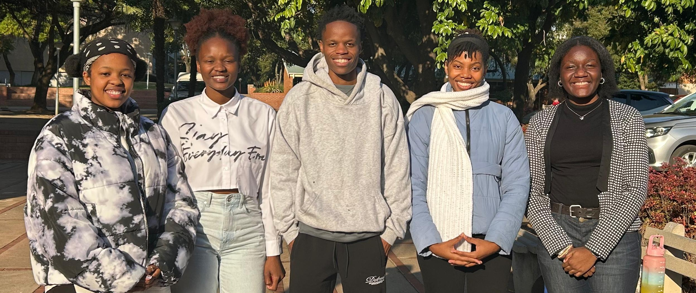

<!-- Project Logo -->

  

<h1 align="center">From Zero to Financial Hero</h1>
<!-- Our logo needs to go here to the right of the following sentence -->
<h2 align="center">
  Presented by <strong>CodeBlooded</strong> 
  
</h2>

<h2 align="center">🚀 Project Badges</h2>

 <!-- 🧪 CI/CD -->       <!-- 🗃️ Repo Info -->   <a href="https://github.com/COS301-SE-2025/Gamified-Financial-Visualizer">     

  

<h1 align="center">Project Overview </h1> 
Gamified Financial Visualizer revolutionizes the way people interact with their finances. By combining gamification, AI-powered insights, and AR visualization, users are empowered to take control of their spending, saving, and goal-setting while enjoying the journey.

> "Financial literacy doesn't have to feel like homework anymore" - Our Vision

  

## 🚀 Core Features That Deliver Results

| Feature | Benefit | Tech Behind It |
|---------|---------|----------------|
| **AI Financial Coach** | Personalized money advice 24/7 | NLP, Machine Learning |
| **AR Spending Tracker** | See expenses as interactive 3D objects | ARKit, Three.js |
| **Goal Gamification** | Earn rewards for financial milestones | Smart Algorithms |
| **Bank-Grade Security** | Read-only access protects user data | OAuth 2.0, Encryption |

  

<h2 align="center">Tech Stack That Powers Innovation</h2>

<h3 align="center">Frontend: Next-Level User Experiences</h3>

  

<h3 align="center">3D & Interactive Visualization</h3>

  

<h3 align="center">Backend: Rock-Solid Foundation</h3>

   
  

<h3 align="center">DevOps: Enterprise-Grade Delivery</h3>

  

<h3 align="center">Testing: For Smooth System Delivery</h3>

  

<h3 align="center">Project Management: With Modern Technology</h3>

  

  

<h2 align="center">Project Documentation Index </h2>

This table provides quick access to the key documents and planning resources for the Gamified Financial Visualizer project.

| Resource Name | Description | Link |
|---------------|-------------|------|
| **Software Requirements Specification (SRS)** | Outlines the functional and non-functional requirements of the system. | [View SRS](https://drive.google.com/file/d/1P-zHO8nlxd5WIi0egwTgvPa18IMBnqpN/view?usp=drive_link) |
| **Architectural Requirements Specification (ARS)** | Describes system architecture, service design, and technology stack. | [View ARS](https://drive.google.com/file/d/1CMtMXzBY3NeMmU1tTGMOL_54sTObispc/view?usp=sharing) |
| **User Stories** | User-focused feature breakdown using Agile methodology. | [View User Stories](https://drive.google.com/file/d/15W0QNBl9YfHC1M-liT4e9_xkXi2rQUrP/view?usp=drive_link) |
| **Use Cases** | Details of system interactions between users and core features. | [View Use Cases](https://drive.google.com/file/d/1RYJx_-DA8SJ5KiFeP35hvWPykjhdn8F3/view?usp=drive_link) |
| **Project Board & Sprint Tracker** | A live board displaying tasks, issues, and sprint progress. | [GitHub Project Board](https://github.com/orgs/COS301-SE-2025/projects/140) |
| **Domain Model** | A visual representation of key entities and their relationships. | [View Domain Model](https://drive.google.com/drive/folders/1DQmIiDWRnHQmnQpzgAyw23VIWb4kCm4y?usp=sharing) |
| **Deployment Model** | A visual representation of the infrastructure setup and shows how different system components are distributed across nodes or services. | [View Deployment Model](https://drive.google.com/file/d/1Up7XcsZnelA8KpyiZsgHkoTTiqgCSU1O/view?usp=sharing) |
| **Project / Group Framework** | Overview of team structure, responsibilities, and collaboration tools. | [View Group Framework](https://www.notion.so/Gamified-Financial-Visualizer-1f842477e71680879e19d535dcb688dc?pvs=4) |
| **Coding Standards** | This document outlines the coding conventions and styles used across the project to promote uniformity, clarity, flexibility, reliability, and efficiency. | [View Coding Standards](https://drive.google.com/drive/folders/1nxFz-W9G-qbLN8TvGWwgk3uLCxURO-uv?usp=sharing) |
| **Service Contract** |  It serves as a formal agreement between backend service providers and frontend/service consumers, ensuring that all endpoints, data formats, authentication mechanisms, and error responses are well-documented and traceable. | [View Service Contract](https://drive.google.com/drive/folders/1uMm1lL_FnIjSP8c2eXFI3WC96dK0-Ekd?usp=sharing) |
| **Technical Installation** |  Step-by-step guide to set up and run the project on Windows, macOS, or Linux. Covers prerequisites, installing Node/Python/PostgreSQL/Redis, configuring environment variables, starting frontend/API/AI services, and notes for Azure deployment & CI/CD. | [View Technical Installation](https://drive.google.com/drive/folders/17MMg3Fh6O4WM_D6UKOXQCcKBrIh-Mc5E?usp=sharing) |
| **User Manual** |  End-user guide to the app’s features and workflows. Explains navigation, learning modules and quizzes, goals, accounts & transactions, budgets, challenges, community posts, and achievements—with screenshots, tips, and troubleshooting. | [View User Manual](https://drive.google.com/drive/folders/1eGzi0SqqqJy4BXIT63ev2gV0308Xb6rm?usp=sharing) |

  

<h2 align="center">Demo Video </h2>

| Demo Video | Documentation |
|------------|----------------|
|[ Demo 1 Video](https://drive.google.com/drive/u/0/folders/11WsEpVxedP9OobPVyirSWup9hacDLVAH) | [Demo 1 Documentation](https://drive.google.com/drive/u/0/folders/1oXzqPzukLE2dVK9OftUkWXMTAlR7tb4I) |
|[ Demo 2 Video](https://drive.google.com/file/d/152yEfAs2liL6fUAY6_nJPMdphsqQRPw6/view?usp=drive_link) | [Demo 2 Documentation](https://drive.google.com/drive/u/2/folders/1qBoA2zMqF3u-Fo400Q0mdA1-wOFhmfVY) |
|[ Demo 3 Video](https://drive.google.com/drive/folders/17R40RsQUSfzsPa6zXZv1KLLmsTFbqvlR?usp=sharing) | [Demo 3 Documentation](https://drive.google.com/drive/u/2/folders/1qBoA2zMqF3u-Fo400Q0mdA1-wOFhmfVY) |

  

<h2 align="center">Meet the CodeBlooded Team</h2>

  

| Photo | Name | About | Role | Links |
|-------|------|-------|------|-------|
|  | **Yohali Malaika Kumangu** | Experienced in backend development with strong expertise in Node.js, PostgreSQL, and Python. Skilled in integration development, database design & schema architecture, and financial management systems. Currently expanding into AI development—building an intelligent chatbot powered by a custom AI model that can answer user questions in real time.  | Project Manager, Data Engineer |     |
|  | **Lebogang Masenya** | Designed and implemented backend architecture using TypeScript, Node.js and PostgreSQL. Developed a custom NLP processing pipeline using DistilBERT and Hugging Face Transformers in Python. Applied classical machine learning techniques with scikit-learn for feature engineering, model training, and evaluation. Led full-stack integration and testing to ensure system robustness and performance. | Systems Architect, Services Engineer |     |
|  | **Mpho Siminya** | Creative front-end developer with a strong track record of turning Figma wireframes into responsive, accessible web apps. Proficient in React (Create React App) with Tailwind, and in Three.js/React Three Fiber for interactive 3D. Additional experience with Unity for AR prototypes, basic gameplay, and animation workflows. | UI Engineer, UI/UX Designer |     |
|  | **Nobuhle Mtshali** |  Passionate about creating seamless digital experiences through modern web and mobile development. With a strong foundation in UI/UX and responsive design, I enjoy building applications that feel intuitive and engaging. I’m especially drawn to DevOps practices and CI/CD automation, where I can bridge development and deployment to deliver impactful solutions at scale. | DevOps, UI Engineer |     |
|  | **Aundrea Ncube** |  Skilled in API integration and backend development using TypeScript and Express.js. to achieve seamless system integration. Contributed to the design and testing of API endpoints, implemented secure database connectivity, and deployed Redis caching on Railway to optimize performance. Additionally, developed system security by implementing Argon2 and bcrypt algorithms, and managed the full deployment process on Microsoft Azure to ensure system scalability and availability.  | Integration & Testing Engineer |     |

  

